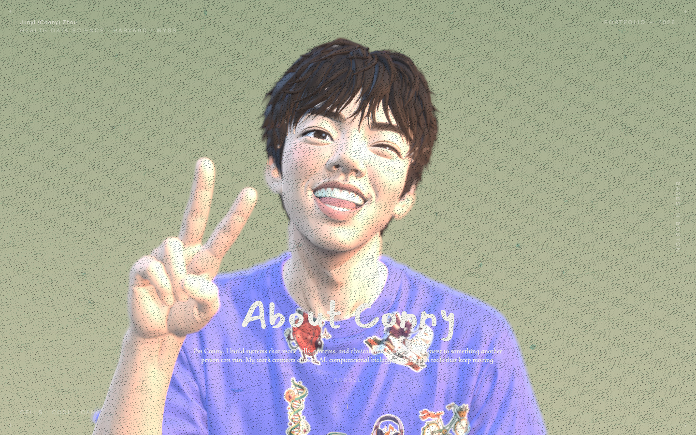
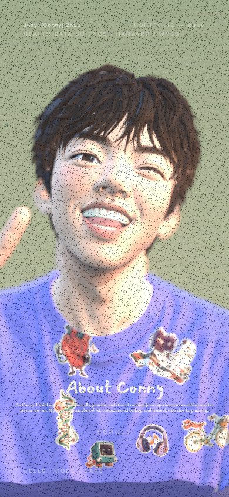

# Conny in the reference scene

This branch runs Conny's wink and peace-sign character in the scene from `dayinji/sen-3d-resume`, through Conny's `JunyiZhou-Conny/my-3d-resume` fork. It is a separate comparison with the existing MeConny website.

## What stays the same

The baseline is commit `c9a9fe373cde72c77ff7f2dabde17fb79dce89b3`. The scene and environment components, CSS, focus-point list, store, Vite configuration, package versions, and lockfile retain the baseline configuration.

The assembled GLB retains the original camera, all seven focus anchors, `CameraAction`, and `manAction`. Camera samples and interpolation modes are copied without resampling. The camera path spans 350 frames at 24 fps. The five timeline stops remain at frames 50, 100, 150, 200, and 250. The works section retains the final camera move and character rotation.

Lighting, the green gradient, grain, shadows, pointer parallax, mobile camera adjustment, depth of field, Bloom, and SMAA keep their original settings. This comparison uses the reference's continuous rendering loop.

## What changes

- Conny's prepared character replaces the original person's body, eyes, textures, and stickers.
- Six illustrated stickers from MeConny sit on Conny's shirt. Four also illustrate the project gallery.
- A uniform fit transform places Conny in the original scene coordinates. It lives in `web/scripts/conny-scene.json`, separate from the scene settings.
- Conny's existing material finishes and color atlas remain attached to the character. The reference person's texture maps do not apply to a different face or shirt.
- The reference has independent eye meshes. Conny's eyes are painted into connected face geometry, so eye tracking is inactive. The wink and peace sign stay as supplied.
- The derivative uses Conny's static bind pose. The source has no head-bone animation to transfer. Its existing `manAction` rotates the whole character during the works sequence.
- The default language is English. The five résumé entries become project themes under `Focus`; no employment dates are invented. Four gallery entries have real project descriptions and repository links.

## Why the character is assembled at export

The reference scene expects one GLB with named camera, animation, and focus objects. An assembled asset preserves that interface without a second runtime loader or another scene controller. The composer validates Conny's bind pose before removing skin attributes. It retains the character's compressed geometry and image bytes, generates shirt decals, and copies the original camera and animation data.

The resulting asset is 5,828,864 bytes. Its SHA-256 is `c4f68c6670534f528d2c663cf4cc0100c8f84c4803b2f28d435e92f8e237a7f7`. Two independent exports produced identical bytes.

See [Run and verify the comparison](run-conny-comparison.md) for preview, assembly, and verification commands.

## What the comparison shows

The reference lighting produces brighter highlights on Conny's face and purple shirt. Its camera path makes tight facial close-ups. The original person's stickers sat on the face, while Conny's stickers sit on the shirt, so these stops no longer point at individual stickers.

Conny's raised hand makes the silhouette wider. The reference mobile camera crops part of that hand. The white hero text also has less contrast over the bright shirt. These are observed differences from using the same settings with a different model. This branch retains them so the comparison stays faithful.

### Desktop

### Phone

## Verification

The production preview passed all 86 checks in [the browser report](comparison/verification.json). Chrome completed the five focus stops, works rotation, and all four project panels at 1440×900 and 390×844. Project links, loaded images, modal dismissal, restored scrolling, camera movement, and horizontal overflow checks passed. Neither viewport reported runtime errors or failed asset requests.

The verifier also compared the scene, environment, CSS, focus list, store, Vite configuration, package manifest, and lockfile byte for byte with the baseline. The original Canvas configuration and authored camera values matched. The asset composer separately verified exact animation sample bytes and targets, anchors, character geometry, materials, and image bytes.

`npm run build` passed. `npm run lint` passed with the same five warnings as the baseline. The build retains the original large-bundle warning. Visual review found no detached stickers, missing surfaces, or residual author assets. These checks do not measure frame rate or certify other browsers.

## Provenance

Upstream source code is covered by the retained `LICENSE`. The retained `NOTICE` distinguishes code from personal assets and third-party assets. The comparison removes the author's personal geometry, texture maps, brand images, displayed biography, social profiles, and work content from the served site.

Camera and focus data come from the original scene. The existing HDR environment and fonts remain unchanged for this local comparison. Their provenance is inherited from the fork; this work does not claim a newly verified redistribution license for those assets. The original Blender file remains upstream reference material, not Conny's editable source.

Conny's model and sticker artwork come from the user's existing MeConny work. No new model generation ran.
